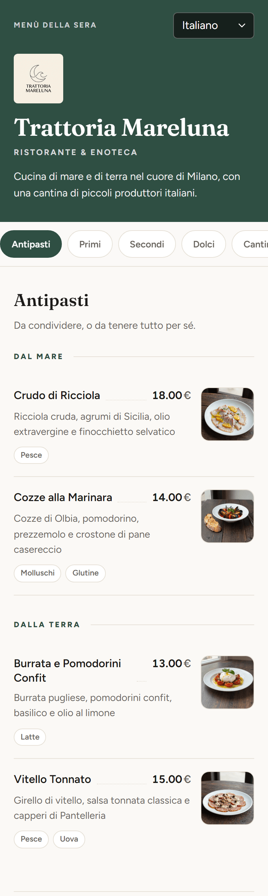

# FoodBoard

A multi-tenant digital menu builder: a restaurant owner designs a menu in the
dashboard — categories, dishes, prices, allergens, translations — and publishes
it to diners as a link or a QR code on the table.

**Live demo: [foodboard-demo.web.app](https://foodboard-demo.web.app)**
· Menus: [Trattoria Mareluna](https://foodboard-demo.web.app/menu/trattoria-mareluna)
· [Caffè Mareluna](https://foodboard-demo.web.app/menu/caffe-mareluna)

Vue 3 and Supabase. Built solo in 2026.

---

## Screenshots



*The published menu a diner sees, opened from a QR code on the table.*

---

## Engineering decisions

### The tenancy boundary lives in Postgres, not in the client

This is the decision the rest of the project hangs off.

The obvious way to build a multi-tenant dashboard is to filter by owner in the
client: `select * from structures where user_id = currentUser.id`. That works
until the day a query is written without the filter — and then it returns
everybody's rows, silently, with no error to notice.

Instead, `anon` is revoked from every table, `authenticated` holds only
`select, insert, update, delete`, and every table carries a policy comparing
`(select auth.uid())::text` to its `user_id` column. The client cannot express
a cross-tenant query, because the database will not answer one.

That inverts the failure mode, which is the whole point. A client bug can now
only fail to fetch **my own** data — a visibly broken page — where before it
could have leaked **someone else's**. One failure is a bug report; the other is
an incident.

Public menus need to be readable by anonymous diners, which is exactly the
requirement that usually forces a hole in a scheme like this. Rather than
granting `anon` read access to `structures` and relying on a policy to narrow
it, there is a single `security definer` function, `get_public_menu(p_slug)`.
It is the only thing `anon` may execute. It takes a slug, returns one published
menu as JSON, and filters out hidden categories and dishes inside the query, so
unpublished content never crosses the boundary in the first place. The tables
stay completely unreachable.

Two smaller choices follow from the same reasoning:

- Policies use `(select auth.uid())` rather than a bare `auth.uid()`. The
  subquery form is evaluated once per statement instead of once per row.
- `rotate_public_slug` is deliberately `security invoker`, not `security
  definer`. It needs no elevation — the existing policy is what stops one
  account rotating another's link, so making it `definer` would have added
  privilege for nothing.

The alternative — filtering in the client — costs nothing to write and
everything to get wrong once. Enforcing it in the database costs a migration
and the discipline of adding a policy per table.

### Images are converted in the browser, before they are uploaded

Restaurant photos arrive straight off a phone: 3–5 MB, often larger. Uploading
them as-is means paying for the storage, paying for the egress every time a
diner opens the menu, and serving a 4 MB JPEG to someone on mobile data outside
the restaurant.

Uploads are resized and re-encoded to WebP in the browser
(`createImageBitmap` → canvas → `toBlob`) before anything leaves the device.
A 1,360 KB logo becomes 13.9 KB. Dishes are capped at 1200px on the long edge,
logos at 800px.

The conversion is written to bow out rather than fail: animated GIFs, browsers
without `createImageBitmap`, browsers whose `toBlob` will not produce WebP
(older Safari), and any case where the re-encode came out *larger* than the
original all fall through to uploading the file untouched. A worse-compressed
image is a much better outcome than a broken upload.

Server-side conversion would have been more reliable and more uniform, but it
needs a function to run it, a queue for retries, and it still pays to upload
the original first. Doing it client-side means the bytes are never sent at all.

### A published menu is addressed by a rotatable slug, not its primary key

Menus were originally served at `/menu/<structure_id>`. Two problems: the demo
ids were `111` and `222`, so the address space was trivially guessable, and a
link could never be withdrawn — the address *was* the row's identity.

Each restaurant now carries a random `public_slug` with a unique index, and
`get_public_menu` looks up by slug. An owner who has printed a QR code onto a
menu card and later needs to kill that link can rotate it.

The migration deliberately drops the id-based lookup rather than keeping it as
a fallback. Leaving it in place would have meant rotation revoked nothing — the
old address would still resolve, and the feature would be theatre.

### Session bootstrap belongs to the router, not to a component

Loading the signed-in account's workspace used to happen in `App.vue`'s
`onBeforeMount`. That hook runs exactly once, and it ran on public pages too,
where there is no session to load.

The result was a bug that looked cosmetic and was structural: arriving at `/`
while already signed in left the store empty, and navigating into the dashboard
from there rendered it without a header — no profile, no settings — because
nothing re-ran the bootstrap.

`store.ensureSession()` is now awaited by the router's navigation guard for
every authenticated route. It is idempotent, and concurrent navigations share
one in-flight promise rather than racing to issue duplicate requests. Tying the
work to navigation rather than to a component's lifecycle means it happens
whenever it is needed and never when it is not.

### QR codes are generated in the browser

The straightforward option is a third-party image API — request a URL, get a
PNG. It also means every restaurant's private menu link is sent to a company
with no relationship to this product, and that the feature breaks when that
service does.

Codes are drawn locally with `qrcode`, pulled in via a lazy `import()` so the
library lands in a 25 kB chunk that only downloads when someone actually opens
the share dialog.

---

## Stack

| Layer | |
| --- | --- |
| Frontend | Vue 3 (`<script setup>`), Vue Router, Pinia, Vite |
| i18n | vue-i18n — dashboard in 3 locales, menus publishable in 9 languages |
| Database | Postgres (Supabase), Row Level Security, `security definer` RPC |
| Auth | Supabase Auth — email/password, confirmation, password reset |
| Storage | Supabase Storage, owner-scoped object paths |
| Tests | Vitest |
| CI/CD | GitHub Actions, Firebase Hosting |
| Tooling | ESLint (flat config) + `@stylistic`, `sharp` for build-time images |

Roughly 9,700 lines across 71 source, script, test and migration files.
Six tables, 25 RLS policies, seven functions, seven triggers, eight migrations.

### Layout

```
src/
  api/            data access — one module per table, errors thrown not returned
  components/     editor widgets, modals, the public-menu lightbox
  views/          routed pages, including the public CustomerMenu
  stores/         Pinia store: workspace state and editor actions
  media.js        image compression, upload, owner-scoped paths
  structureShape.js  defaults and repairs for the structure JSONB
  descriptorFields.js  the stored field names, in one place
supabase/migrations/   schema, policies, functions — the security model
scripts/          demo seeding and one-off maintenance
tests/            Vitest suites
```

---

## Testing

`npm test` — **88 passing**, plus 9 that are opt-in.

| Suite | Covers |
| --- | --- |
| `tests/apiOwnership.test.js` | every write carries its owner column |
| `tests/structureShape.test.js` | defaults, contact normalisation, legacy repair |
| `tests/shapes.test.js` | the JSONB descriptor builders used by the seed |
| `tests/menuTranslations.test.js` | translation lookup and fallback rules |
| `tests/media.test.js` | image URL resolution and resize arithmetic |
| `tests/pageMeta.test.js` | per-menu title and description |
| `tests/qr.test.js` | local QR generation |
| `tests/rls.test.js` | **opt-in** — cross-account isolation, against a real database |

Two are worth singling out.

**`tests/rls.test.js` is the one that proves the security model** rather than
assuming it. It signs in as two separate accounts against a real Supabase
project and asserts that each is refused the other's data: that B cannot read
A's row, that it does not surface in an unfiltered select either, that
cross-account updates and deletes change nothing, and that an insert claiming
another account as owner is rejected outright. It then checks that `anon` is
refused by all five workspace tables, that the public-menu RPC is nonetheless
reachable anonymously, and that it cannot be tricked into resolving a structure
by its id instead of its slug. Every other suite tests logic that *surrounds*
the boundary — this one tests the boundary. It stays skipped unless
`RLS_TEST_A_*` and `RLS_TEST_B_*` are set, because it needs two real confirmed
accounts and will not create them.

**`tests/apiOwnership.test.js` exists because of a real bug.** Duplicating a
menu wrote two rows without a `user_id`, against columns that are `NOT NULL`
behind an ownership policy — so the feature could not have worked. The fix was
structural rather than a patch: the data-access layer now takes `userId` as a
required argument, and this suite asserts every write still sends it. Reverting
the fix turns the suite red.

---

## Known limitations

Written plainly, because these are the parts I would want asked about.
What is planned but not built is in [ROADMAP.md](ROADMAP.md).

- **Records are stored as UI form descriptors, not as domain objects.** A dish
  is an array of form-field definitions with one localised tab per language, and
  the field names inside it are Italian strings (`Titolo`, `Descrizione`) that
  the data itself depends on. It made the editor almost free to build — the
  dashboard renders the descriptor directly — and it has been wrong at every
  point since. Querying is awkward, the storage format is coupled to the UI's
  layout, and renaming a label means migrating every row.
  `src/descriptorFields.js` keeps the strings in one place so the eventual
  migration to typed columns has a single seam to cut, but that migration is
  the real fix and it has not happened. **I would model this as proper columns
  from the start if I built it again.**
- **Published menus are public to anyone holding the link.** That is the
  product working as intended. A link can be rotated, but not expired or
  password-protected.
- **Abandoned uploads are never collected.** Choosing an image uploads it
  immediately, so cancelling the edit leaves an object in the bucket that
  nothing references. Deleting an account through the Supabase dashboard rather
  than through the app leaves its whole folder behind, because Postgres is not
  permitted to delete storage objects and the cascade trigger deliberately does
  not try. Both want a scheduled sweep that neither has yet.
- **Link previews on WhatsApp, Slack and LinkedIn are generic.** Menus set
  their own `title` and `og:` tags at runtime, which is enough for browsers,
  bookmarks and Google. Those scrapers do not execute JavaScript, so they read
  the static tags in `index.html` instead. Fixing it properly needs an edge
  function that renders the tags server-side.
- **No component tests.** The pure logic and the data-access layer are covered;
  the Vue components are not. That is the largest gap.
- **Single account per restaurant.** No staff logins, no roles. A real
  restaurant would need a membership table and policies keyed on it.

---

## Running it locally

Requires **Node 22 or newer** — `@supabase/supabase-js` needs a native
`WebSocket`, which older versions lack.

```bash
git clone <this repo>
cd foodboard
npm install
cp .env.example .env
```

Fill in `.env` from your Supabase project's API settings:

```
VITE_SUPABASE_URL=https://<your-project-ref>.supabase.co
VITE_SUPABASE_PUBLISHABLE_KEY=<your publishable/anon key>
```

The publishable key is safe in a browser bundle — it carries the `anon` role,
which is revoked from every table and may call exactly one function. The
`service_role` key is the opposite: it bypasses RLS entirely, so it must never
carry a `VITE_` prefix or Vite will inline it into the client bundle.

Apply the schema, either with the Supabase CLI:

```bash
supabase db push
```

or by pasting the files in `supabase/migrations/` into the SQL editor **in
filename order**. They create the tables, add ownership and RLS, define the
public-menu function, and narrow the default grants.

Then:

```bash
npm run dev
```

Register an account through the app and confirm the email; the signup trigger
creates the profile row. Other commands:

```bash
npm run build     # production build
npm test          # unit suites
npm run lint      # eslint
npm run seed      # rebuild the demo restaurants (needs the service_role key)
```

### Seeding the demo

`npm run seed` rebuilds the showcase restaurants from `scripts/demo-data.js`.
It is idempotent and scoped to the showcase account's own rows, so it cannot
touch another workspace. [A scheduled workflow](.github/workflows/reset-demo.yml)
runs it daily so the published demo menus stay correct.

It needs two more variables in `.env` (and, for the scheduled run, as
repository secrets):

| Variable | Why |
| --- | --- |
| `SUPABASE_SERVICE_ROLE_KEY` | RLS scopes every table to its owner, so the publishable key cannot write these rows. |
| `SHOWCASE_USER_ID` | The auth user id that owns the demo restaurants. Without it the seed assigns them to a placeholder and they will not appear in your dashboard. |

Menu content in `demo-data.js` is written in a flat, readable shape — one entry
per dish, translations grouped — and `seed.js` converts it into the JSONB the
database expects, so editing the demo does not require understanding the
storage format.

## Copyright and permissions

Copyright (c) 2026 Alexandru Lungu. All rights reserved.

The source is public for portfolio review; this is not an open-source project.
Reuse, modification and redistribution require prior written permission,
except where applicable law or GitHub's Terms of Service permit otherwise.
Third-party dependencies and materials retain their own licenses.
See [LICENSE](LICENSE) for the full notice and permission requests.
